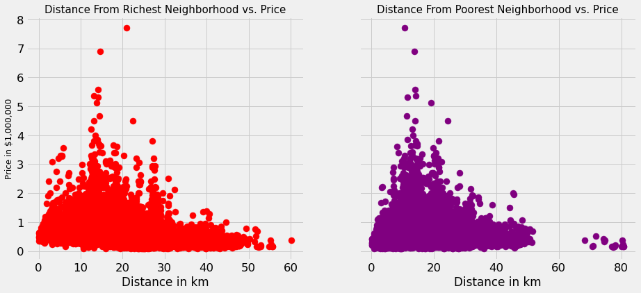
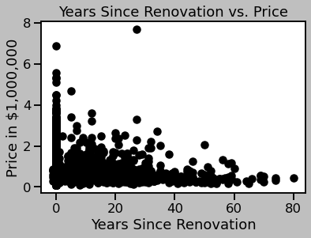
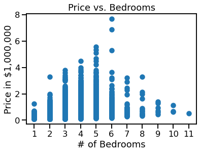
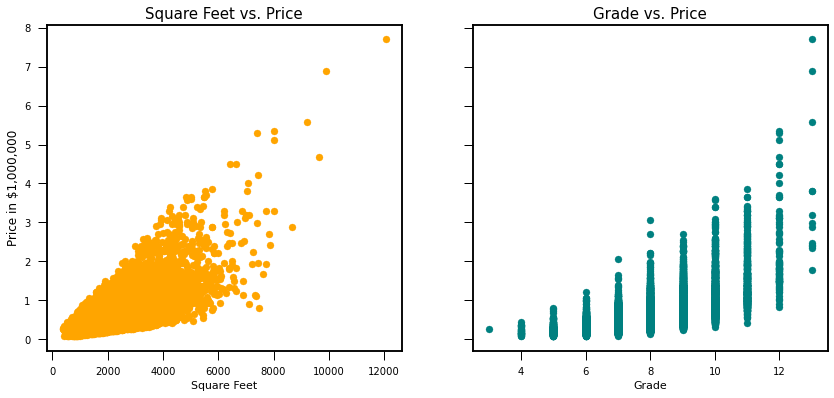
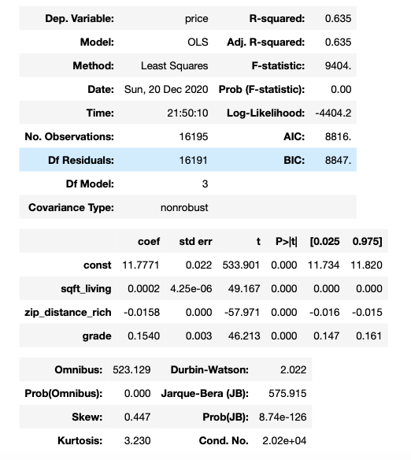

# Module 2 Final Project

## Introduction

With the housing data, I set out to create the simplest linear regression model possible given the information available. Along with fulfilling all the required assumptions of linear regression, I also sought out to obtain an R^2 value of atleast .55. This process required a lot of guess and check, creating several different models until I was satisfied with the results. I was even able to make some variables of my own to help the accuracy and simplicity of my model. 

## Objectives:

Main criteria to fulfill:
* Create the simplest linear regression model possible
* Obtain an R^2 value above .55
* Create and use atleast one engineered variable in the final model

## Business

From a business point of view, this model would mostly be used for aspiring first-time home owners in the King-County area who want a ball-park estimate of how much money they need to end up spending for a particular house of a certain size, grade, and location.

## Engineered Variables

Everyone knows that location is a very important factor for housing. The same house in a good neighborhood can be worth drastically more than in a bad neighborhood. Instead of turning zip codes into categorical variables, I decided it would be best to find a single number to describe location for each row. What I ultimately decided to do was to find the richest and poorest neighborhoods out of all the zip codes, and then find the mean latitude and longitude coordinates of the richest and poorest neighborhoods. From there, I made two seperate variables that were able to find out how far each house was from the poorest, and richest neighborhoods in km. 

For the distance from the poorest neighborhood, I was expecting the price to go up the higher the value of x was from 0, and the opposite for the distance from the richest neighborhood. Each of the scatter plots followed a relatively strong negative correlation, meaning that the data for distance from the richest neighborhood could possibly provide some meaningful information. As it turned out, this variable also ended up in my final model.

Another engineered variable created tracked the years since each house had been renovated. Houses that had never been renovated had a value of zero.

While the houses that had been renovated followed a relatively strong negative relationship, this model was eventually wasn't used in the final model just due to the fact that there were many houses that also had never been renovated that were still selling for either very high or low prices.

# Final Model

One surprise to me was that the amount of bedrooms wasn't used in the final model. While number of bedrooms is typically another important feature that is critical in deciding the price of a house, the data for bedrooms wasn't the most helpful in this data set. 

While there is a general pattern for houses that have 1-5 bedrooms, houses that have more than 5 bedrooms start to decline in price. There is also not much data for houses above 6 bedrooms, resulting in fairly high p-values/variance for each model run with bedrooms included as a variable. While it does seem like an important factor for deciding the price of a house, the final model was able to pass all goals/assumptions even without bedrooms as a main variable.

# Variables Used

#### Square Feet
#### Grade
#### Distance from Richest Neighborhood

The variables that ended up being used in the final model were the grade of the house, the amount of square feet, and the distance from the mean coordinated of the richest neighborhood. Each of these variables worked in the final model because they each shared a positive correlation with the price of the house. 

While Distance from the richest neighborhood shared a negative relationship with the price of the house, we can see above that both square feet, and grade of the house shared a positive relationship with the price. In the final model, all models were included as continuous variables, even the grade of the house. While the grade looks like it could have been categorical, it ended up working better as a continuous variable in the final model. 

# Final Model Results

As seen, an R^2 value of above .55 was achieved, as well as p-values below .05 for all of the variables. The natural log of the price was used as the dependent variable in order to achieve homoscedasticity. The results essentially show that the natural log of the price increases by .0002 for each extra square foot(.02% increase in price), decreases by .0158 for each km away from the richest neighborhood(1.56% decrease in price), and increases by .1540 for each extra improvement in grade(16.6% increase in price). These results make sense, as we expect price to go up for extra square feet and improvement in grade, as well as price to go down for each additional km away from the richest neighborhood.

# Conclusion 

All the objectives written out at the beginning of the project have been accomplished. Furthermore, the model has obtained type of simplicity where only three variables are used while still maintaining a baseline of accuracy. 